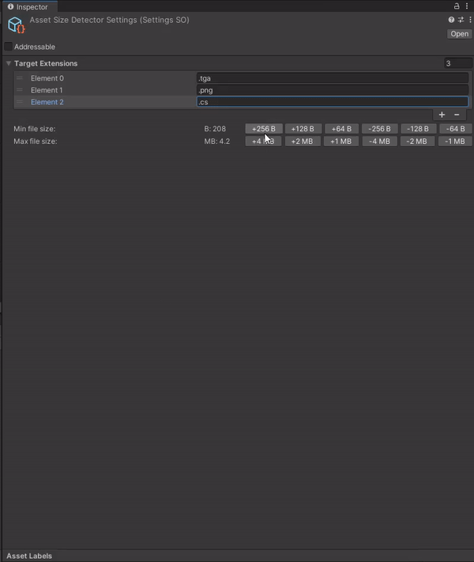
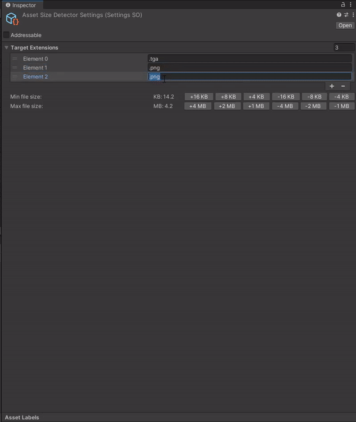
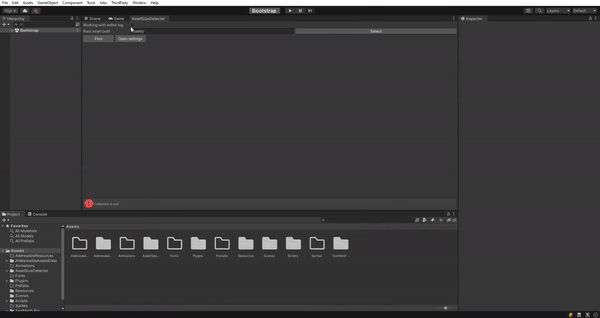
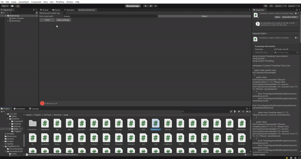

# Описание
Эксперименты с unity editor...
Инструмент который позволяет в удобном виде посмотреть локально какие ресурсы в проекте занимают бОльшую часть проекта.
Также есть возможность распарсить editor.log, чтобы увидеть самые большие ресурсы в сжатом формате, уже используемых ресурсов в билде 

# Настройка размеров:

# Настройка расширений:

# Парсинг editor.log:

# Парсинг локальных ассетов:

